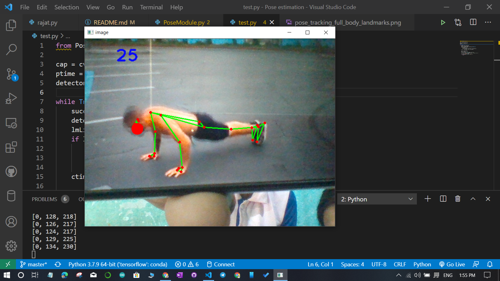

# Pose-estimation
### Position numbers for different positions.

### sample photos of results.

Reference for the project:\
[Murtaza's Workshop - Robotics and AI](https://www.youtube.com/watch?v=brwgBf6VB0I&t=1788s&ab_channel=Murtaza%27sWorkshop-RoboticsandAI)